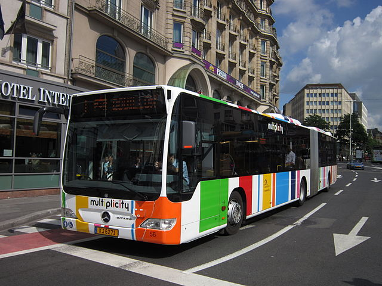

##⚠️ Unfortunately I am not able to work on the skill at the moment and as a result it is currently broken due to a change in the Mobiliteit API ⚠️

## Welcome

Lëtz Go is an Alexa skill to check bus times in Luxembourg. Find the next bus leaving your stop and refine by bus number or destination. With up-to-the-minute expected departure times.

You can ask for buses from and to any stop in Luxembourg. Save a favourite stop and Alexa will remember it as your departure stop for next time.

Please bear in mind that Alexa has trouble understanding place names sometimes. If you are finding it hard to get her to understand it may help to pronounce the stop name as though it were an English word.

### Installation

Lëtz Go is available in the following marketplaces. More marketplaces and languages are coming soon.

* amazon.co.uk (British English): [desktop](https://www.amazon.co.uk/dp/B085C3W99K/)/[mobile](https://skills-store.amazon.com/deeplink/dp/B085C3W99K)
